# REVVIO / Revvender — Documentação Mobile Tela a Tela

> Documentação funcional completa do sistema na **versão mobile**, tela por tela,
> com print real e descrição do comportamento de cada sessão (bloco) da página.
>
> **Capturas:** Chrome headless · viewport **390 × 844** (iPhone 12/13/14), DPR 2,
> user-agent iOS Safari, páginas capturadas em *full page* (a imagem mostra a
> rolagem inteira da tela, não só o primeiro dobra).
> **Ambiente:** `npm run dev` apontando para o projeto Supabase de produção;
> sessão autenticada como **admin** (`admin@revvio.com`), que também possui
> perfil de loja (`Revvio Oficial`) e por isso alcança tanto `/dashboard` quanto
> `/painel`.
> **Data da captura:** 28/07/2026.

---

## Índice

1. [Visão geral do sistema](#1-visão-geral-do-sistema)
2. [Mapa de rotas](#2-mapa-de-rotas)
3. [Padrões globais de comportamento mobile](#3-padrões-globais-de-comportamento-mobile)
4. [Área pública](#4-área-pública)
5. [Autenticação e telas de status](#5-autenticação-e-telas-de-status)
6. [Painel do Garagista / Vendedor (`/painel`)](#6-painel-do-garagista--vendedor-painel)
7. [Painel Administrativo (`/dashboard`)](#7-painel-administrativo-dashboard)
8. [Módulo Afiliados (desativado por feature flag)](#8-módulo-afiliados-desativado-por-feature-flag)
9. [Comportamento de sessão (transversal)](#9-comportamento-de-sessão-transversal)
10. [Observações e achados de UX mobile](#10-observações-e-achados-de-ux-mobile)

---

## 1. Visão geral do sistema

**Revvio (marca visual "REVVENDER")** é um marketplace multi-vendedores de
veículos. Cada loja (garagista) tem uma **mini-loja pública**, um **painel
próprio** e controle financeiro por comissão; o **admin** governa a plataforma
como um SaaS (planos, assinaturas, cobrança ASAAS, contratos).

**Stack:** React 18 + Vite + TypeScript · React Router 6 (lazy/code-splitting por
rota) · TanStack Query · React Hook Form + Zod · Tailwind · **Supabase**
(Postgres + Auth + Storage + Realtime + Edge Functions).

**Arquitetura:** *Supabase-first* — o frontend fala direto com o Supabase pelo
SDK. O isolamento de dados é feito por **RLS por `seller_id`**; regras sensíveis
(cálculo de comissão, exclusões) vivem em **RPC Postgres `SECURITY DEFINER`**
(`register_sale`, `delete_sale`, `delete_team_member`, `admin_delete_store`,
`admin_delete_seller`…). Guards de rota são apenas UX/navegação.

### Papéis (`rv_sellers.role`)

| Papel | Onde entra | O que enxerga |
|---|---|---|
| `admin` | `/dashboard` (e `/painel` via seletor de contexto) | Tudo: plataforma inteira |
| `garagista` | `/painel` | A própria loja: estoque, equipe, vendas, comissões, financeiro, mini-loja |
| `vendedor` | `/painel` (nav reduzida) | Estoque da loja (compartilhado) + **só as próprias** vendas/comissões |
| `afiliado` | `/afiliado` | **Desativado** por feature flag |
| comprador (`rv_buyers`) | `/minha-conta` | Perfil próprio; usado para liberar contato com a loja |

O `AuthProvider` deriva: `isAdmin`, `isGaragista`, `isVendedor`, `isBuyer`,
`role`, `personId` (id do próprio seller) e **`lojaId` = `parent_id ?? id`** —
é esse `lojaId` que faz um vendedor enxergar o estoque da loja do garagista pai.

---

## 2. Mapa de rotas

Definido em `src/App.tsx`.

### Público
| Rota | Componente | Observação |
|---|---|---|
| `/` | `public/pages/Home` | Home do comprador |
| `/comprar` | `public/pages/Marketplace` | Catálogo + filtros |
| `/vender` | `public/pages/Vender` | Landing do garagista + planos |
| `/veiculo/:id` | `public/pages/VehicleDetails` | Detalhe do anúncio |
| `/loja/:slug` | `public/pages/Storefront` | Mini-loja pública |
| `/politica-de-privacidade` | `PoliticaPrivacidade` | LGPD |
| `/termos-e-condicoes` | `TermosCondicoes` | Termos de uso |
| `*` | `Placeholder` | 404 |

### Autenticação / status
| Rota | Componente | Observação |
|---|---|---|
| `/login` | `auth/pages/Login` | Senha + "esqueci minha senha" |
| `/cadastro` | `CadastroComprador` | Conta de comprador |
| `/cadastro-vendedor` | `CadastroVendedor` | **Exige `?plan=`**, senão redireciona a `/vender` |
| `/minha-conta` | `MinhaConta` | Só comprador logado |
| `/definir-senha` | `DefinirSenha` | Destino do link de convite/recuperação |
| `/pagamento-confirmado` | `PagamentoConfirmado` | Retorno do checkout ASAAS |
| `/aguardando-aprovacao` | `StatusPages` | `status = pending` |
| `/conta-suspensa` | `StatusPages` | `status = suspended` |
| `/app` | `RoleRedirect` | Roteia por papel após login |
| `/conta` | `Placeholder` | Rota autenticada genérica (stub) |

### Painel do vendedor — `RoleRoute roles={["garagista","vendedor"]}`
`/painel` · `/painel/leads`¹ · `/painel/veiculos` · `/painel/vendedores`¹ ·
`/painel/vendas` · `/painel/financeiro`¹ · `/painel/gerador-whatsapp`¹ ·
`/painel/perfil`¹
&nbsp;&nbsp;¹ só gestor (garagista/admin) — `ManagerOnly` no financeiro e nav condicional nas demais.

### Admin — `RoleRoute roles={["admin"]}`
`/dashboard` · `/sellers` · `/sellers/:id` · `/leads` · `/financial` ·
`/planos` · `/veiculos` · `/movimentacoes` · `/mini-lojas` · `/contratos` ·
`/contratos/novo` · `/contratos/:id` · `/aparencia`

### Afiliado — condicionado a `AFFILIATES_ENABLED`
`/afiliado` · `/afiliado/desempenho` · `/afiliado/perfil` — **hoje `false`**
(`src/config/features.ts`): as rotas nem sequer são montadas.

---

## 3. Padrões globais de comportamento mobile

### 3.1 Casca pública (`PublicShell`)
`PublicHeader` (sticky, `z-40`) + `main` + `PublicFooter`.

- **Faixa de contato preta** (h 36px): e-mail sempre visível; telefone só a
  partir de `sm`; endereço só a partir de `md` — **no mobile aparece apenas o
  e-mail**.
- **Header branco** (h 68px): logo → (nav "Comprar/Vender" **oculta abaixo de
  `sm`**) → botões. **Não existe menu hambúrguer no site público**: no mobile a
  navegação entre Comprar/Vender só acontece pelo rodapé, pelos CTAs internos ou
  pela logo.
- Deslogado: botão **Entrar** (o botão "Área do anunciante" some abaixo de `sm`).
  Logado: **Painel / Minha conta** (destino conforme papel) + **Sair**.
- **Rodapé** empilhado em coluna única: marca + contatos, colunas MENU /
  ANUNCIANTE / LINKS ÚTEIS, e a barra legal final.

A mini-loja e a `/vender` usam a variante `PublicTopBar` (barra preta única,
sem faixa de contato).

### 3.2 Casca dos painéis (`PanelShell`) — o padrão mobile mais importante

Usada **igual** pelo Admin e pelo Painel do garagista.

- Abaixo de `lg` (1024px) a sidebar **sai do fluxo e vira drawer** de 268px,
  animado por `transform` + `visibility` (fora da tela ele sai da ordem de
  tabulação, não fica focável escondido).
- Aparece uma **topbar mobile fixa** (h 56px, `sticky top-0 z-30`):
  `☰ Abrir menu` · logo (variante *mark*) · badge do papel · **sino de
  notificações**.
- **Backdrop preto 50%** cobre a página com o drawer aberto; clicar nele fecha.
- Com o drawer aberto: **scroll do body travado** e **Esc fecha**.
- **Trocar de rota fecha o drawer automaticamente** (`useEffect` em `pathname`).
- O **sino é montado uma única vez**: na sidebar no desktop, na topbar no mobile
  — decidido por `useMediaQuery(LG_QUERY)`, não por CSS, porque ele assina
  canais Realtime e duas instâncias assinariam duas vezes.
- Rodapé do drawer: **"Ver minha loja"** (garagista com slug) ou **"Ver
  Marketplace"** (admin) + **Sair** em vermelho.

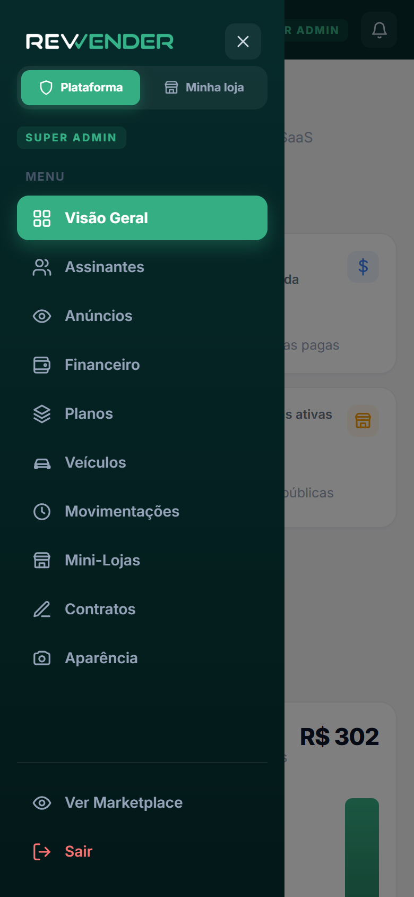

### 3.3 Seletor de contexto (só admin)
`ContextSwitcher` renderiza **Plataforma ↔ Minha loja** no topo do drawer e
alterna `/dashboard` ↔ `/painel` **sem relogin**. Para quem não é admin
`return null` — a UI do painel fica inalterada.

### 3.4 Modais
`Modal` (`components/ui-light.tsx`): overlay `fixed inset-0 z-50`,
`overflow-y-auto` + `overscroll-contain`, padding **12px no mobile** (28px a
partir de `sm`) e `max-w-2xl` (ou `max-w-4xl` com `wide`). Na prática, **no
celular o modal ocupa quase a tela inteira** e rola dentro do overlay.
Formulários usam `closeOnBackdrop={false}` para não perder o preenchimento com
um toque acidental fora da caixa.

### 3.5 Tabelas
Todas as tabelas de painel ficam dentro de `overflow-x-auto` com
`min-w-[640px … 1080px]` na `<table>`. **No mobile a tabela rola
horizontalmente dentro do card** — a página em si não rola lateralmente.

### 3.6 Notificações em tempo real
`useRealtimeNotifications` assina `postgres_changes` do Supabase:
- **Admin:** novo veículo (`INSERT rv_vehicles`) e novo vendedor
  (`INSERT rv_sellers`) — invalida as queries `admin-vehicles` / `admin-sellers`.
- **Vendedor:** mudança de status da própria conta (aprovado / suspenso /
  reativado).
Badge com contador (`9+` no teto), abre painel de 300px (`min(300px,
calc(100vw-2rem))`), fecha ao clicar fora, e **abrir marca tudo como lido**.
No mobile o painel abre alinhado à direita (`align="right"`).

### 3.7 Rascunho de formulário
`lib/formDraft.ts` grava em `localStorage` (`rv-draft:v1:…`, **TTL 24h**) os
valores + URLs de imagens já enviadas do cadastro de veículo, com debounce.
Ao reabrir o formulário, oferece restaurar. É o que salva um cadastro longo de
um refresh acidental no celular.

### 3.8 Carregamento
Todas as rotas são `lazy`; o fallback global é o texto **"Carregando…"**.
Os guards mostram o mesmo texto enquanto `loading` do `AuthProvider` estiver
ligado.

---

## 4. Área pública

### 4.1 `/` — Home

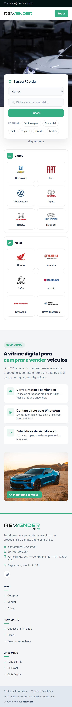

**Quem acessa:** qualquer visitante. **Arquivo:** `public/pages/Home.tsx`
(compõe `HomeHero`, `HomeMarcas`, `HomeQuemSomos`).

**Sessões, de cima para baixo:**

1. **Faixa de contato + header** — no mobile só `contato@revvio.com.br` e o
   botão **Entrar**.
2. **Banner (`HomeHero`)** — imagem de **460px de altura** no mobile (548px a
   partir de `sm`). A URL vem de `rv_site_settings.home_banner_url` (definida em
   *Admin → Aparência*); se estiver vazia, cai num fallback do Unsplash.
3. **Card "Busca Rápida"** — posicionado em `absolute bottom-0` com
   `translate-y-1/2`, ou seja, **metade sobre o banner, metade sobre a seção
   seguinte**. No mobile os controles empilham em coluna:
   - `select` de categoria (Carros / Motos / Caminhões) — **estado local, ainda
     não entra na busca**;
   - campo de texto (busca por marca/modelo) — **Enter dispara**;
   - botão **Buscar** → navega para `/comprar?q=<termo>` (ou `/comprar` se
     vazio);
   - chips **POPULAR**: Volkswagen, Chevrolet, Fiat, Toyota, Honda, Motos —
     cada chip navega direto para `/comprar?q=<marca>`.
4. **"EXPLORE POR MARCA / Marcas Mais Buscadas"** — dois blocos (Carros e Motos)
   com grade de logos 2 colunas no mobile. Toque em uma marca leva ao catálogo
   filtrado.
5. **"QUEM SOMOS"** — headline + 3 itens (categorias, WhatsApp direto,
   estatísticas) + foto com selo *Plataforma confiável*.
6. **Rodapé** completo.

**Observação mobile:** por causa do card flutuante de busca, o título
*"EXPLORE POR MARCA / Marcas Mais Buscadas"* fica **parcialmente coberto** — na
captura só se lê o final da linha ("disponíveis"). É o achado nº 1 da seção 10.

---

### 4.2 `/comprar` — Marketplace (catálogo)

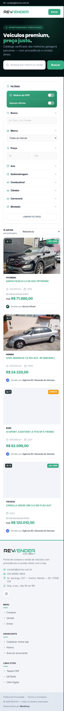

**Arquivo:** `public/pages/Marketplace.tsx`. **Dados:** `usePublicVehicles()` —
`rv_vehicles` com `status = 'available'` **e** `blocked = false`, mais recentes
primeiro. Veículo de loja bloqueada/removida não aparece.

**Sessões:**

1. **Hero escuro** — selo *OPORTUNIDADES VERIFICADAS*, título
   "Veículos premium, preço justo." e a **barra de busca** (campo + botão
   Buscar). O termo inicial vem de `?q=` da URL.
2. **Painel FILTROS** — no desktop é um `aside` sticky de 278px; **no mobile a
   grade colapsa para 1 coluna e o painel de filtros aparece inteiro ACIMA dos
   resultados** (`grid-cols-1 … lg:grid-cols-[278px_1fr]`).
   - Dois **toggles** no topo verde: **Abaixo da FIPE** (só `price < fipe_price`)
     e **Apenas ofertas** (`featured = true`).
   - **Seções recolhíveis** (cada uma abre/fecha com chevron): Busca, Marca,
     Preço (De/Até), Ano, Quilometragem, Combustível, Câmbio, Carroceria,
     Blindado.
   - A lista de **Marcas** é derivada dinamicamente dos veículos carregados.
   - **LIMPAR FILTROS** reseta tudo.
3. **Barra de resultados** — contador ("4 carros encontrados") + `select` de
   ordenação: **Relevância · Menor preço · Maior preço · Ano mais novo**.
4. **Grade de cards** — `grid-cols-1` no mobile (2 em `sm`, 3 em `xl`). Cada
   `MarketplaceCard` traz: contador de fotos, selo **-x% FIPE** ou **OFERTA**,
   marca, modelo, km, ano, preço (com "DE … (FIPE) / POR …" quando abaixo da
   FIPE) e a linha **"Vendido por <loja>"**. O card inteiro leva a
   `/veiculo/:id`.
5. **Rodapé**.

**Toda a filtragem e ordenação é client-side** (`useMemo` sobre a lista já
carregada) — não há paginação nem refetch por filtro.

**Estado com busca aplicada** (`/comprar?q=Honda`) — o contador cai para
"1 carros encontrados":

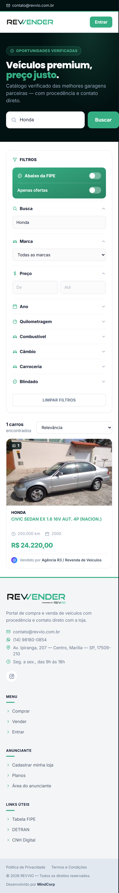

---

### 4.3 `/vender` — Landing do garagista + planos


**Arquivo:** `public/pages/Vender.tsx` (574 linhas). É o **funil de aquisição do
lojista** e a única porta de entrada do cadastro de garagista.

**Sessões:**

1. **Hero** — "Sua garagem online, vendendo todo dia." + CTAs **Ver planos e
   preços** (scroll suave até `#rv-pricing`) e **Ver loja de exemplo**
   (`/loja/auto-prime`). Abaixo, 3 métricas de prova social (47 garagens ativas ·
   1.284 veículos · 7 dias grátis) e um mock de mini-loja com badge "Novo lead!".
2. **COMO FUNCIONA** — 4 passos numerados (criar conta → montar mini-loja →
   publicar veículos → receber leads no WhatsApp).
3. **POR QUE A REVVIO** — 6 cards de benefício.
4. **PLANOS** (`#rv-pricing`) — **toggle Mensal / Anual (-20%)**, default
   **Anual**. Os planos vêm de `rv_pricing_plans` (`active = true`, ordenados por
   `sort_order`); hoje: **Essencial, Profissional (MAIS ESCOLHIDO), Enterprise**.
   - Botão **Escolher <plano>** → `navigate('/cadastro-vendedor?plan=<key>&cycle=<monthly|annual>')`.
   - O plano **Enterprise** troca o CTA por **Falar com vendas**, que abre
     `mailto:contato@revvio.com.br`.
5. **Tabela comparativa** — "Compare os planos em detalhe" (rola
   horizontalmente no mobile).
6. **Depoimento** + **FAQ** — 5 perguntas em acordeão (`useState` por item).
7. **CTA final** — "Escolher meu plano" (scroll para os planos) e **Falar no
   WhatsApp** (`wa.me/5514981800854`).
8. **Rodapé simplificado** (endereço + copyright), sem o rodapé grande.

---

### 4.4 `/veiculo/:id` — Detalhe do anúncio

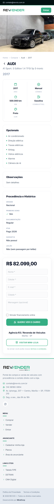

**Arquivo:** `public/pages/VehicleDetails.tsx` (539 linhas).
**Dados:** `usePublicVehicle(id)` — exclui `blocked = true` e `status = removed`.

**Sessões (mobile empilha tudo em coluna única):**

1. **Galeria** — imagem grande + setas ‹ › e contador. Tocar na foto abre o
   **lightbox** em tela cheia.
2. **Breadcrumb** — Home › Comprar › `<Marca>` › `<Ano>`.
3. **Título** — marca (com link de volta), modelo e ano.
4. **Grade de especificações** — Ano, Câmbio, KM, Combustível, Cor (2 colunas
   no mobile).
5. **Opcionais** — lista com bullets, vinda de `rv_vehicles.options`.
6. **Observações** — `description` (ou "Sem detalhes").
7. **Procedência e Histórico** — Origem, Primeiro dono, Documentação, IPVA,
   Garantia, Leilão.
8. **Card de preço + formulário de lead** — no desktop é uma coluna lateral
   sticky; **no mobile vem depois de todo o conteúdo**. Contém:
   - preço (com FIPE riscada acima quando `fipe_price > price`);
   - campos obrigatórios **Nome, Celular (máscara), E-mail, Cidade** e
     **Mensagem (opcional)**;
   - checkbox **Simular financiamento online**;
   - botão **QUERO VER O CARRO** — desabilitado, com aviso *"Vendedor sem
     WhatsApp cadastrado"*, se a loja não tiver WhatsApp;
   - bloco do vendedor: nome (link para a mini-loja), cidade/UF e botão
     **VISITAR MINI-LOJA**;
   - aviso de aceite dos termos.
9. **Rodapé**.

**Comportamento do botão "QUERO VER O CARRO" (o coração do funil):**

1. `validate()` — se faltar campo, mostra erro em vermelho abaixo do input e
   **para aqui** (nada é gravado).
2. Se o visitante **não estiver logado**, abre o **modal de criação de conta do
   comprador** (o *gate* de login) já pré-preenchido com o que ele digitou.
3. Já logado (ou logo após autenticar pelo modal), o `doSubmit`:
   - `track(v.id)` — incrementa `clicks` do veículo;
   - `logClick('vehicle_interest', seller_id, vehicle_id)` — grava em
     `rv_click_events`;
   - `createLead.mutate({...})` — grava o lead em `rv_leads` (best-effort: se
     falhar, **não bloqueia** o WhatsApp);
   - monta a mensagem (carro, preço, **`Ref.: RV-xx`**, nome, celular, e-mail,
     mensagem, financiamento) e abre o **WhatsApp da loja**.
   - `fromUserGesture` distingue o clique direto do retorno do cadastro — fora
     do gesto do usuário o `window.open` cairia no bloqueador de pop-ups.

**Estado — lightbox de imagem aberto** (contador "1 / 1" no topo):

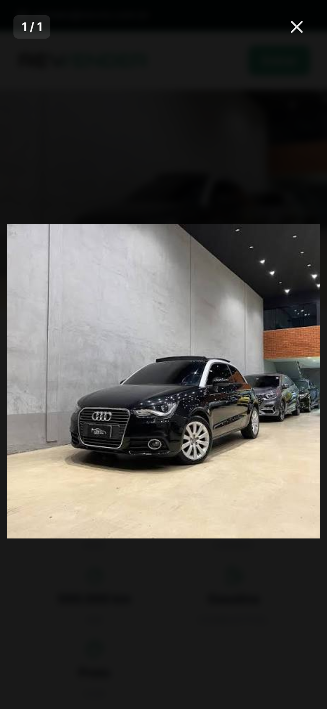

**Estado — gate de login do comprador** (formulário preenchido + toque em
"Quero ver o carro" sem sessão):

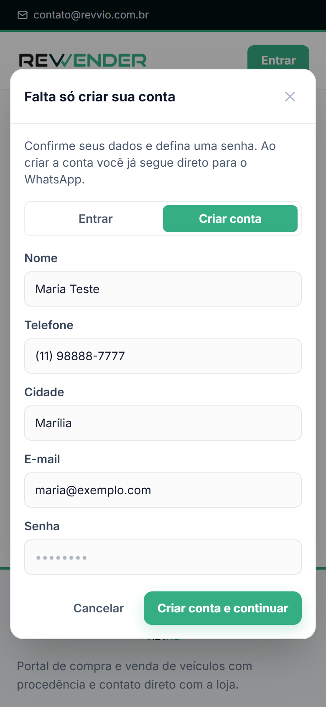

O `BuyerAuthModal` tem **duas abas — Entrar / Criar conta** — vem pré-preenchido
com Nome/Telefone/Cidade/E-mail do formulário, pede só a **Senha**, e o CTA é
**"Criar conta e continuar"**. Ao autenticar, o envio pendente é concluído
automaticamente (`pendingSend` + `useEffect` sobre `user`), então o comprador
**não precisa clicar de novo**.

---

### 4.5 `/loja/:slug` — Mini-loja (storefront)

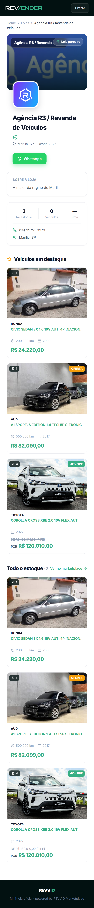

**Arquivo:** `public/pages/Storefront.tsx`. **Dados:** `useStorefront(slug)` —
busca o seller pelo slug e, em paralelo, o estoque `available` + `blocked=false`
e a contagem de `sold`.

**Sessões:**

1. **PublicTopBar** (barra preta) + **breadcrumb** Home › Lojas › `<loja>`.
2. **Banner da loja** (230px, com gradiente escuro por cima) com o **nome da
   loja** sobreposto e o selo *Loja parceira*.
3. **Cartão de perfil** — avatar (ou inicial), nome, cidade/UF, "Desde `<ano>`" e
   botões **WhatsApp** e **Instagram** quando cadastrados.
4. **SOBRE A LOJA** — `bio` ou o texto padrão *"Esta loja ainda não adicionou uma
   descrição."*
5. **Métricas** — *No estoque* · *Vendidos* · *Nota* (a nota ainda é `—`).
6. **Contatos** — telefone/WhatsApp e cidade.
7. **Veículos em destaque** — os 3 primeiros do estoque.
8. **Todo o estoque · N** + link **Ver no marketplace**; grade de cards em 1
   coluna no mobile. Sem estoque, exibe *"Este vendedor ainda não tem veículos
   disponíveis."*
9. **Rodapé da mini-loja** — "Mini-loja oficial · powered by REVVIO Marketplace".

**Comportamento dos canais (WhatsApp / Instagram):** o clique é interceptado
(`e.preventDefault()`). Se **não houver sessão**, abre o mesmo `BuyerAuthModal`
do detalhe do veículo; com sessão, registra o clique
(`store_whatsapp` / `store_instagram` em `rv_click_events`) e só então abre o
link externo. É esse registro que alimenta o bloco *"Acessos a canais externos"*
no painel do garagista.

**Estado de erro:** slug inexistente ou loja inativa → *"Loja não encontrada"* +
botão **Ir ao marketplace**.

---

### 4.6 `/politica-de-privacidade` e `/termos-e-condicoes`

| Política de Privacidade | Termos e Condições |
|---|---|
|  | 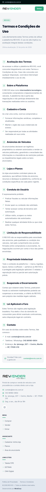 |

Mesmo componente base (`legal/LegalPage.tsx`) dentro do `PublicShell`: cabeçalho
com selo REVVIO, título, resumo, data da última atualização (22/06/2026) e
seções numeradas. **Política:** 10 seções (LGPD — dados coletados, uso,
retenção, compartilhamento, cookies, direitos do titular, segurança, DPO).
**Termos:** 11 seções (aceitação, natureza de intermediário, cadastro, anúncios,
planos, conduta, limitação de responsabilidade, PI, suspensão, foro, contato).
Ambas terminam com o bloco *"Dúvidas? Fale com a gente em contato@revvio.com.br"*
e o rodapé completo. **Conteúdo estático** — sem interação além dos links.

---

### 4.7 `*` — 404

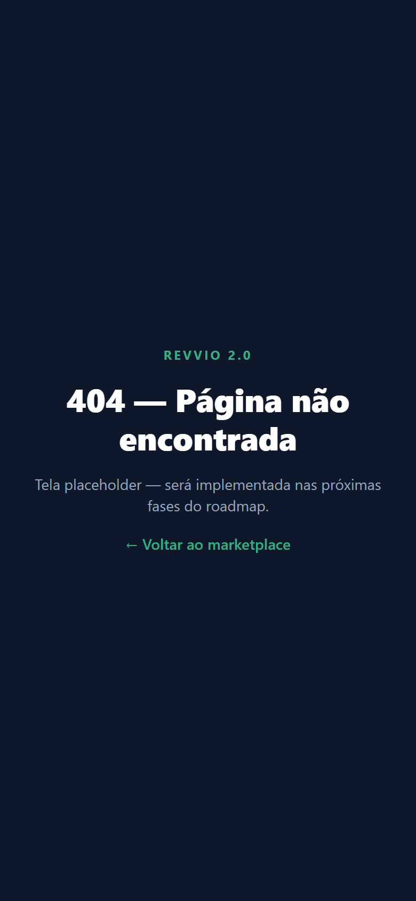

`Placeholder` genérico: "REVVIO 2.0", **404 — Página não encontrada**, o aviso
*"Tela placeholder — será implementada nas próximas fases do roadmap"* e o link
**← Voltar ao marketplace**. A mesma tela é usada pela rota `/conta`.

---

## 5. Autenticação e telas de status

Todas usam o `AuthSplitLayout`: no desktop são duas colunas (painel de marca
escuro à esquerda + formulário à direita). **No mobile a coluna de marca é
escondida (`hidden lg:flex`)** e sobra só o formulário centralizado, com a logo
escura no topo — por isso todas as telas desta seção parecem "limpas" no celular.

### 5.1 `/login`


Campos **E-mail** e **Senha** (ícones à esquerda, olho de mostrar/ocultar na
senha), validação Zod, e botão **Entrar** (vira "Entrando…").

- Sucesso → `navigate('/app')` → `RoleRedirect` decide o destino.
- Erros são traduzidos: `invalid login credentials` → **"E-mail ou senha
  incorretos."**; `email not confirmed` → **"Confirme seu e-mail antes de
  entrar."**
- **Esqueci minha senha** — usa o e-mail já digitado no campo acima; se estiver
  vazio, mostra *"Informe seu e-mail acima para recuperar a senha."*; senão
  dispara `resetPasswordForEmail` com retorno para `/login` e exibe o aviso verde
  *"Enviamos um link de recuperação para o seu e-mail."*
- Rodapé com dois caminhos: **Cadastre-se como garagista** (→ `/vender`) e
  **É comprador? Criar conta** (→ `/cadastro`).

### 5.2 `/cadastro` — conta de comprador

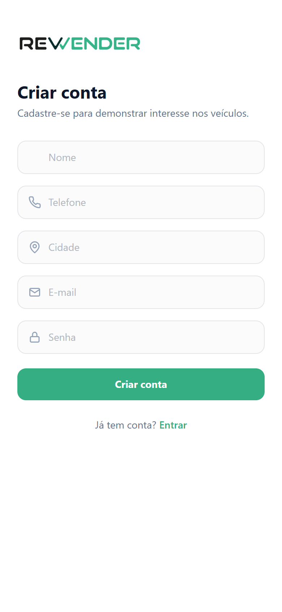

Formulário simples (sem labels, só ícone + placeholder): **Nome, Telefone
(máscara), Cidade, E-mail, Senha**. Validação local: todos preenchidos, telefone
com ≥ 10 dígitos e senha com ≥ 6 caracteres, senão *"Preencha todos os campos
(senha com no mínimo 6 caracteres)."*

- E-mail já cadastrado → *"Este e-mail já tem conta. Faça login."*
- Se o projeto exigir confirmação de e-mail, redireciona para `/login` com o
  aviso *"Conta criada! Confirme o e-mail e faça login."*; senão já cria a
  sessão e volta para `/`.

### 5.3 `/cadastro-vendedor` — cadastro de garagista

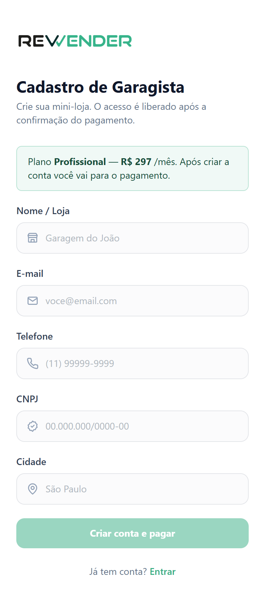

> **Comportamento de rota:** acessar `/cadastro-vendedor` **sem `?plan=`**
> executa `<Navigate to="/vender" replace />`. O cadastro só existe a partir de
> um plano escolhido. O print acima é de
> `/cadastro-vendedor?plan=profissional&cycle=monthly`.

- **Faixa verde do plano** — "Plano **Profissional** — **R$ 297** /mês. Após
  criar a conta você vai para o pagamento." (no ciclo anual mostra
  `price_annual × 12` e "/ano").
- Campos: **Nome / Loja**, **E-mail**, **Telefone** e **CNPJ** (lado a lado a
  partir de `sm`, empilhados no mobile) e **Cidade**.
- **Validação de CNPJ com enriquecimento:** ao sair do campo (`onBlur`), se o
  CNPJ tiver 14 dígitos e passar no dígito verificador, chama a Edge Function
  `cnpj-lookup`. Estados exibidos: *"Consultando CNPJ…"* → **✓ razão social —
  cidade/UF** (e **preenche Nome e Cidade automaticamente**) ou mensagem
  vermelha de erro. Um contador de geração (`lookupGen`) descarta respostas
  obsoletas se o usuário continuar digitando.
- **O botão "Criar conta e pagar" fica desabilitado enquanto o CNPJ não for
  validado** (`cnpjStatus !== 'valid'`).
- Submit → Edge Function `signup-checkout` → redireciona o navegador para a
  `invoiceUrl` do ASAAS. A conta só nasce depois do webhook confirmar o
  pagamento.

### 5.4 `/pagamento-confirmado`


Retorno do checkout ASAAS (`callback.successUrl`). Título **"Pagamento recebido
🎉"**, caixa verde explicando que foi enviado um e-mail para **definir a senha**,
alternativa via *"Esqueci minha senha"* e link **Ir para o login**. Tela
puramente informativa.

### 5.5 `/definir-senha`

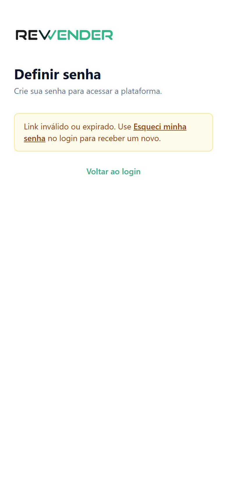

Destino do link de convite/recuperação. Na montagem:

1. Se houver `?token_hash=` na URL, chama `verifyOtp` **no JavaScript** — de
   propósito, para que scanners de e-mail não consumam o token antes do usuário.
2. Senão, tenta a sessão já criada pelo formato antigo (token na hash).

**Três estados:** *"Carregando…"* → formulário **Nova senha** (com olho de
mostrar/ocultar) e botão **Definir senha e entrar** → ou o aviso âmbar
**"Link inválido ou expirado. Use Esqueci minha senha no login para receber um
novo."** (é o estado do print, por termos aberto a rota sem token).
Senha < 6 caracteres → *"A senha precisa ter ao menos 6 caracteres."*
Sucesso → `/app`.

### 5.6 `/aguardando-aprovacao` e `/conta-suspensa`

| Cadastro em análise (`pending`) | Conta suspensa (`suspended`) |
|---|---|
| 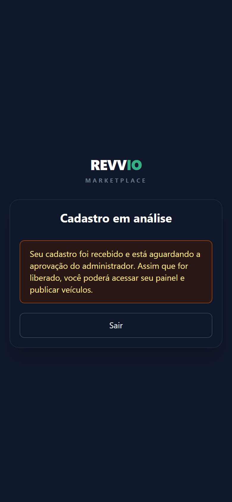 | 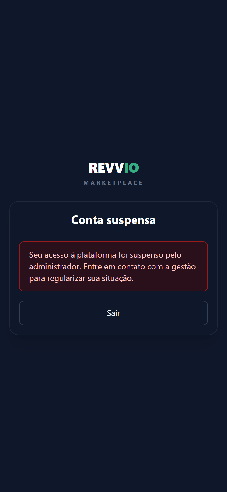 |

Usam o `AuthLayout` (logo REVVIO MARKETPLACE + card). São **destinos forçados
pelos guards**: qualquer tentativa de acessar `/painel` com `status = pending`
ou `suspended` cai aqui. Trazem um alerta (amarelo / vermelho) e **um único
botão: Sair** — não há como navegar para dentro do sistema a partir delas.
A de aprovação personaliza a saudação com o nome da loja quando disponível.

### 5.7 `/minha-conta` — conta do comprador

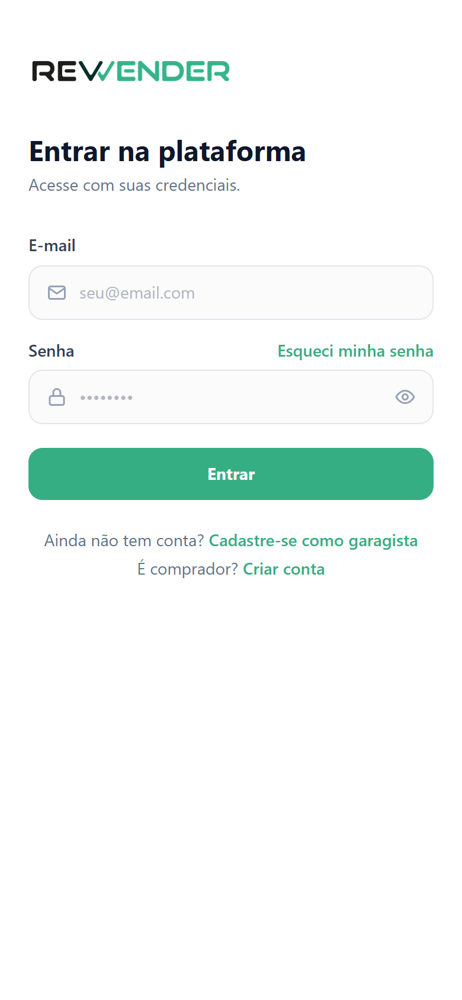

> **O print mostra a tela de login**, e isso é o comportamento correto: a rota
> tem três desvios encadeados —
> `loading` → "Carregando…" · **sem `user` → `/login`** · **logado mas não
> comprador → `/app`**. A captura foi feita sem sessão de comprador.

**Quando um comprador logado abre a rota**, vê dentro do `PublicShell` um card
com: **Nome**, **E-mail** (desabilitado), **Telefone** (máscara), **Cidade** e
**Nova senha (opcional — "Deixe em branco para manter")**, além dos botões
**Sair** (ghost, à esquerda) e **Salvar**. O salvamento atualiza `rv_buyers`, e
só chama `auth.updateUser({password})` se o campo de senha estiver preenchido;
ao fim exibe o alerta verde *"Dados atualizados."*

---

## 6. Painel do Garagista / Vendedor (`/painel`)

Casca: `PainelLayout` → `PanelShell` com badge **GARAGISTA** (ou **VENDEDOR**).

**Menu do gestor (garagista/admin):** Dashboard · Leads · Veículos · Vendedores ·
Vendas · Financeiro · Gerador WhatsApp · Perfil / Mini-Loja.
**Menu do vendedor comum:** apenas **Dashboard · Veículos · Vendas** — Leads,
Vendedores, Financeiro, Gerador e Perfil somem da navegação, e `/painel/financeiro`
ainda é bloqueado por `ManagerOnly` (redireciona para `/painel`).

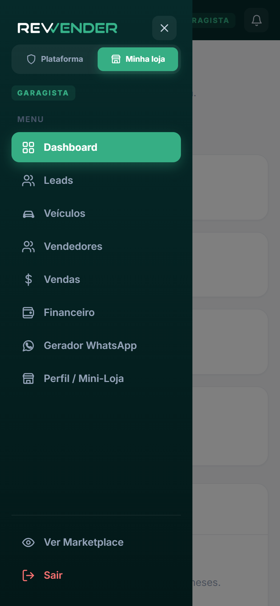

### 6.1 `/painel` — Dashboard da loja

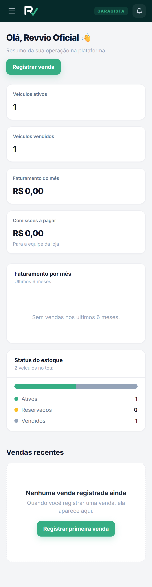

**Sessões:**
1. **Cabeçalho** — "Olá, `<nome>` 👋" + subtítulo + botão **Registrar venda**
   (é um `Link` que **navega para `/painel/vendas`**, não abre modal aqui).
2. **4 KPIs empilhados** (1 coluna no mobile): **Veículos ativos**, **Veículos
   vendidos**, **Faturamento do mês**, **Comissões a pagar** (com a legenda
   *"Para a equipe da loja"*).
3. **Faturamento por mês** — gráfico de barras dos últimos 6 meses
   (`DashboardCharts`); vazio mostra *"Sem vendas nos últimos 6 meses."*
4. **Status do estoque** — barra proporcional + legenda **Ativos / Reservados /
   Vendidos** com os totais.
5. **Vendas recentes** — tabela; vazia mostra o *empty state* pontilhado
   *"Nenhuma venda registrada ainda"* + botão **Registrar primeira venda**
   (também um link para `/painel/vendas`).

**Escopo dos dados:** o garagista vê a loja inteira; o **vendedor vê apenas as
próprias vendas e comissões** (RLS + filtro por `personId`).

### 6.2 `/painel/leads` — Leads

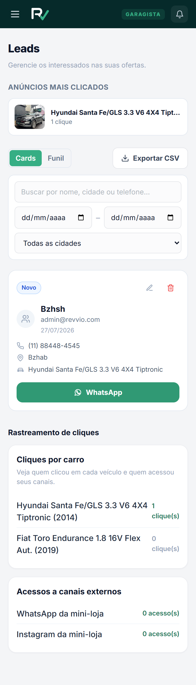

**Só gestor.** Componente compartilhado `LeadsView` (o admin usa uma variação).

**Sessões:**
1. **ANÚNCIOS MAIS CLICADOS** (`TopClickedCards`) — carrossel/lista dos veículos
   com mais cliques, com miniatura e contador.
2. **Barra de controle** — alternador **Cards | Funil** e botão **Exportar CSV**
   (desabilitado sem resultados).
3. **Filtros** — busca por nome/cidade/telefone, intervalo de datas (`De` – `Até`)
   e `select` de cidade.
4. **Lista de leads** — cada `LeadCard` traz: etiqueta de estágio, ícones de
   **editar** e **excluir**, nome, e-mail, data, telefone, cidade, veículo de
   interesse e o botão verde **WhatsApp** (abre a conversa já com o contexto).
5. **Rastreamento de cliques** (`ClickTrackingPanel`) — **Cliques por carro**
   (lista veículo → nº de cliques) e **Acessos a canais externos** (WhatsApp e
   Instagram da mini-loja).

**Excluir** pede confirmação em modal antes de remover.

**Estado — visão Funil (Kanban):**

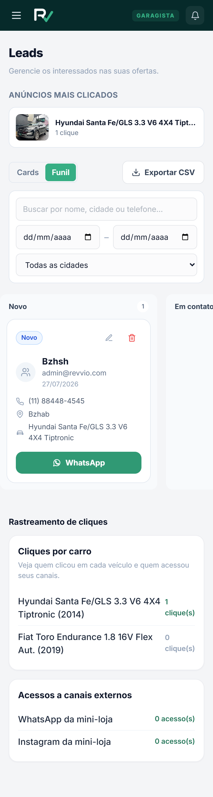

O funil tem 5 colunas — **Novo · Em contato · Negociando · Ganho · Perdido** —
cada uma com o contador de cards. É drag-and-drop (`@dnd-kit`) e **no mobile
rola horizontalmente**: só a primeira coluna cabe na tela, as demais entram
arrastando lateralmente. Mover um card entre colunas atualiza o estágio do lead.

### 6.3 `/painel/veiculos` — Meus Veículos

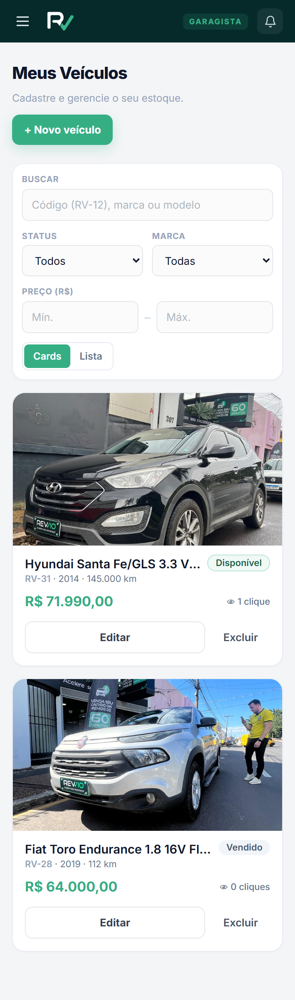

**Sessões:**
1. **Cabeçalho** + botão **+ Novo veículo**.
2. **Barra de filtros** — BUSCAR, STATUS (Todos/Disponível/Reservado/Vendido),
   MARCA (derivada do próprio estoque) e faixa de PREÇO (de – até).
3. **Alternador Cards | Lista**.
4. **Cards** — foto, título, **referência `RV-xx` · ano · km**, chip de status,
   preço, **👁 N clique(s)** e as ações **Editar** e **Excluir**.

**Escopo:** o estoque é **da loja** (`lojaId`), compartilhado entre garagista e
vendedores; ambos podem cadastrar.

**Estado — visão Lista:**

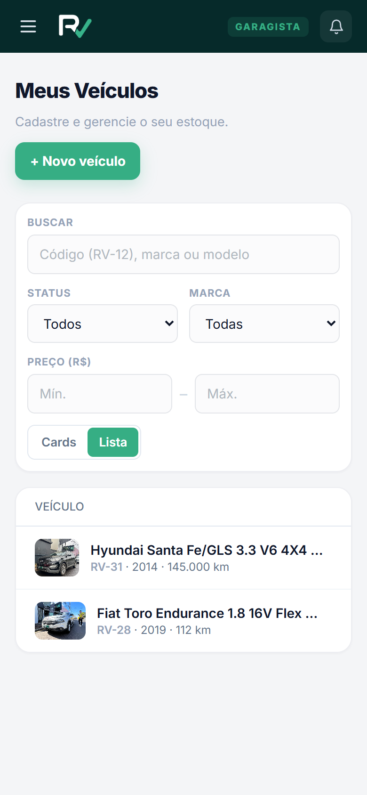

Tabela com VEÍCULO · STATUS · ANO · CLIQUES · PREÇO · FIPE · AÇÕES,
com rolagem horizontal dentro do card.

**Estado — modal "Novo veículo":**

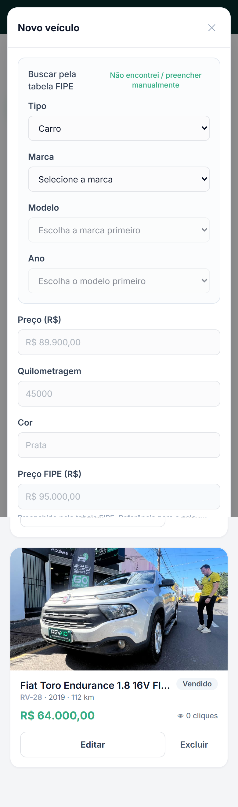

É o formulário mais longo do sistema — no mobile ocupa a tela toda e rola dentro
do overlay (fechar por toque fora está **desativado**). Blocos:

- **Buscar pela tabela FIPE** (`FipeSelector`) — **Tipo** (Carro/Moto/Caminhão) →
  **Marca** (lista completa da FIPE) → **Modelo** ("Escolha a marca primeiro") →
  **Ano** ("Escolha o modelo primeiro"). Selecionar preenche marca/modelo/ano e o
  **Preço FIPE**. Há o escape **"Não encontrei / preencher manualmente"**.
- **Dados comerciais** — Preço, Quilometragem, Cor, **Preço FIPE** (com a nota
  *"Referência para o selo 'abaixo da FIPE'"*), **Status** e **Vendedor
  responsável** (*"A quem este veículo está atribuído"*).
- **Ficha técnica** — Combustível, Câmbio, Carroceria.
- **Opcionais** — multi-seleção em dropdown ("Selecione os opcionais…").
- **Flags** — **Blindado** e **Destacar (oferta)** (é o que gera o selo OFERTA no
  marketplace).
- **Proprietário** — Nome e Telefone do dono original, com o aviso *"Diferente de
  você — é o dono original"* (grava em `rv_vehicle_owners`; **owner ≠ seller**).
- **Procedência** — Origem, Primeiro dono, Passagem por leilão, Documentação,
  IPVA, Garantia, Descrição.
- **Imagens** — upload múltiplo direto (*"Você pode enviar várias"*), sem etapa
  de recorte, com remoção individual por miniatura; os arquivos vão para o
  bucket `vehicle-images/<lojaId>/` (`uploadMedia`). No celular o seletor de
  arquivo abre a galeria/câmera do aparelho.
- Rodapé: **Cancelar** / **Cadastrar veículo** (ou "Salvar alterações" na edição).

**Rascunho:** enquanto se digita, o formulário é salvo em `localStorage`
(`vehicle:<lojaId>:<id|novo>`, TTL 24h) e oferecido de volta na próxima abertura;
**Cancelar** pede *"Descartar o preenchimento deste formulário?"* antes de
limpar. Ao gravar no banco, o rascunho é apagado.

**Excluir** abre a modal "Excluir veículo" com o `ReasonField` **obrigatório** de
motivo — Vendido fora da plataforma · Desistência do proprietário · Cadastro
duplicado · Erro de cadastro · Veículo indisponível · **Outro** (libera campo de
texto livre). O veículo vai para `status = removed` com `removal_reason`,
`removed_at` e `removed_by` — é isso que alimenta *Admin → Movimentações →
Remoções*.

### 6.4 `/painel/vendedores` — Equipe

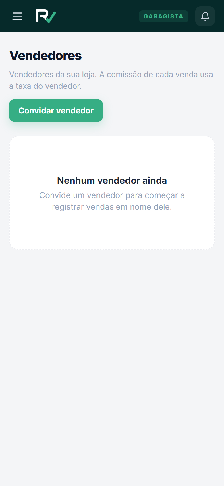

**Só gestor.** Cabeçalho explicativo *"A comissão de cada venda usa a taxa do
vendedor"*, botão **Convidar vendedor** e, sem equipe, o *empty state*
*"Nenhum vendedor ainda — Convide um vendedor para começar a registrar vendas em
nome dele."* com o CTA repetido.

Com equipe, cada linha mostra nome, e-mail, taxa (%) e status, com ações
**Editar vendedor** (modal), **suspender/reativar** e **Excluir vendedor**
(RPC `delete_team_member`).

**Estado — modal "Convidar vendedor":**

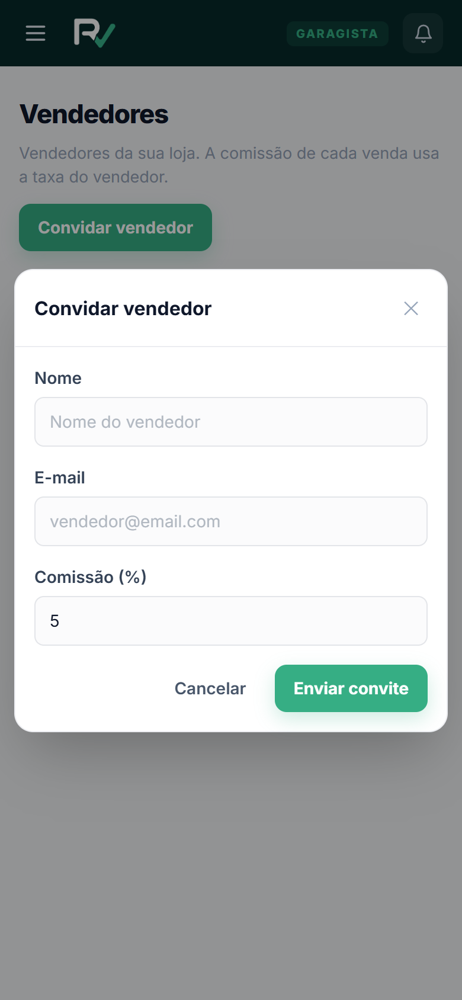

Três campos — **Nome**, **E-mail**, **Comissão (%)** — e o botão **Enviar
convite**, que chama a Edge Function `invite-vendedor` (`inviteUserByEmail`). O
vendedor nasce **ativo**, vinculado à loja (`parent_id`), e define a senha pelo
link do e-mail (`/definir-senha`).

### 6.5 `/painel/vendas` — Minhas Vendas

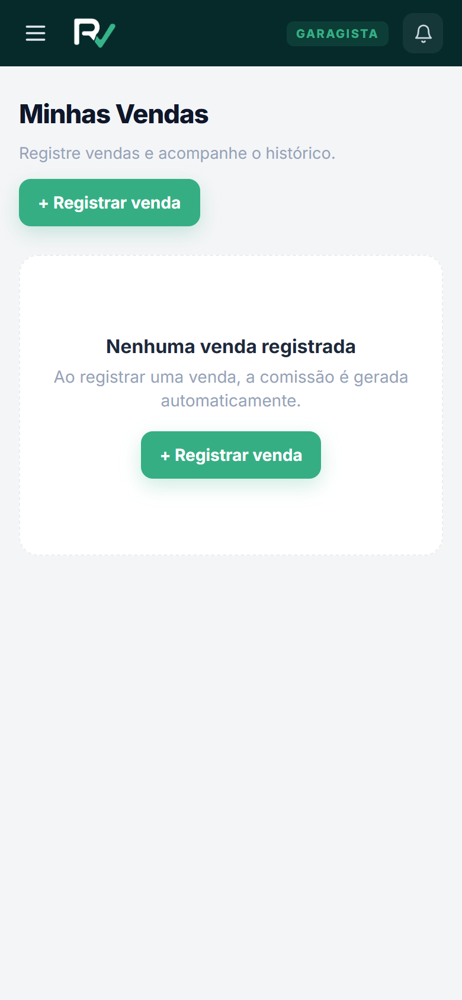

Cabeçalho + **+ Registrar venda**; sem vendas, o *empty state*
*"Nenhuma venda registrada — Ao registrar uma venda, a comissão é gerada
automaticamente."* Com vendas, tabela com data, veículo, comprador, forma de
pagamento, motivo e valor (a coluna do vendedor aparece para o gestor). Excluir
usa a RPC `delete_sale` com confirmação.

**Estado — modal "Registrar venda":**

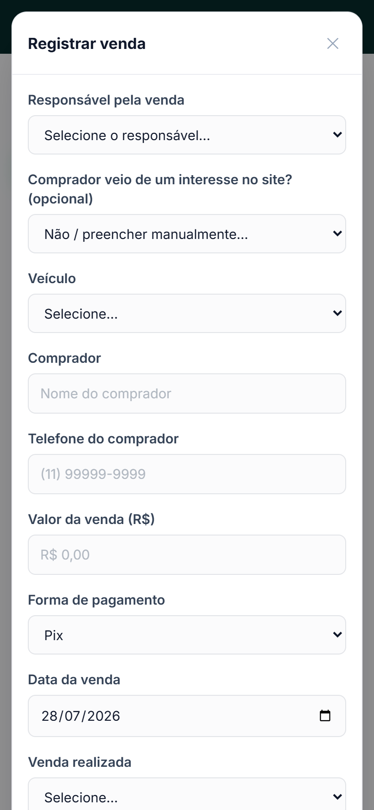

Campos, na ordem:
1. **Responsável pela venda** — lista a equipe com a taxa entre parênteses
   (ex.: *"Revvio Oficial (5%) — você (garagista)"*). Para o vendedor comum, a
   venda é **sempre atribuída a ele mesmo**.
2. **Comprador veio de um interesse no site? (opcional)** — permite **vincular um
   lead existente**, que preenche nome/telefone/veículo automaticamente.
3. **Veículo** — só o estoque da loja, com ano e preço no rótulo.
4. **Comprador** e **Telefone do comprador**.
5. **Valor da venda (R$)** e **Forma de pagamento** (Pix / À vista /
   Financiamento).
6. **Data da venda** (default: hoje).
7. **Venda realizada** — `ReasonField` obrigatório: Através da Plataforma
   Revvio · Cliente veio presencialmente na loja · Por indicação · Outro.

Rodapé com o aviso: *"Sua comissão pela intermediação é calculada
automaticamente no servidor com base na sua taxa configurada."* — o submit chama
a RPC **`register_sale`**, que cria venda + comissão atomicamente e calcula
`sale_price × commission_rate / 100` **no banco**; o cliente nunca envia a taxa.

### 6.6 `/painel/financeiro` — Financeiro

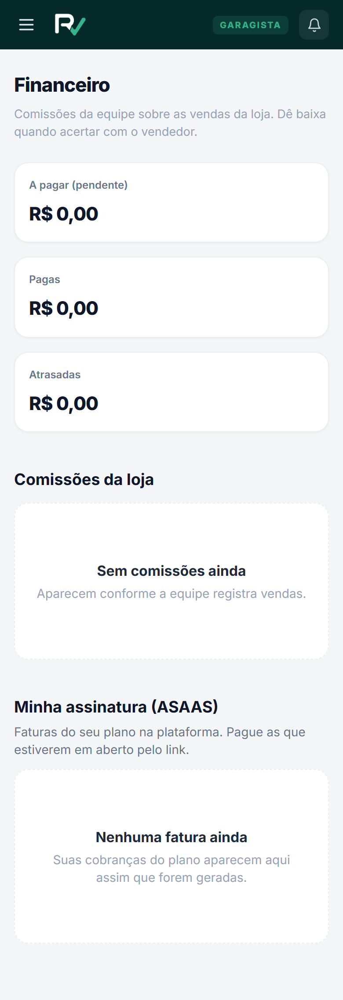

**Só gestor** (`ManagerOnly`; vendedor é redirecionado para `/painel`).

**Sessões:**
1. **3 KPIs** — **A pagar (pendente)** · **Pagas** · **Atrasadas**.
2. **Comissões da loja** — lista das comissões da equipe com a ação **marcar
   como paga** e **reverter** (RPC; reflete na hora). Vazio:
   *"Sem comissões ainda — Aparecem conforme a equipe registra vendas."*
3. **Minha assinatura (ASAAS)** — *"Faturas do seu plano na plataforma. Pague as
   que estiverem em aberto pelo link."* Lista `rv_charges` da loja com status e
   link de pagamento. Vazio: *"Nenhuma fatura ainda."*

**Regra de papel:** o vendedor **não** dá baixa em comissão — a ação existe só
para o gestor.

### 6.7 `/painel/gerador-whatsapp` — Gerador de copy

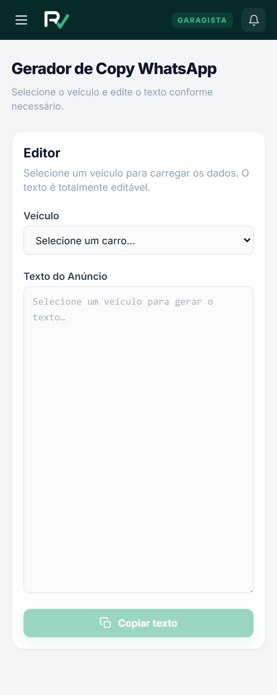

**Só gestor.** Duas partes (empilhadas no mobile):
- **Editor** — `select` **Veículo** ("Selecione um carro…" + o estoque com ano) e
  a área **Texto do Anúncio**, totalmente editável.
- Escolher um veículo **preenche o texto automaticamente** com os dados do
  anúncio (`lib/whatsappCopy.ts`); o botão **Copiar texto** joga o resultado no
  clipboard, pronto para colar no WhatsApp/status.

### 6.8 `/painel/perfil` — Perfil / Mini-Loja

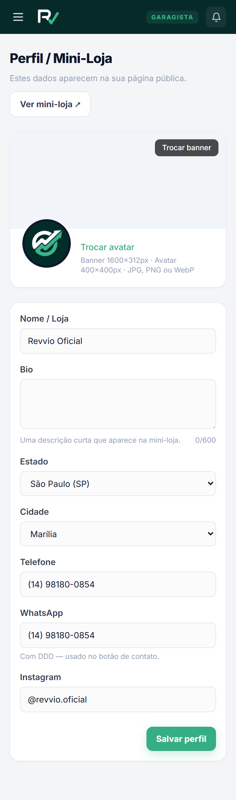

**Só gestor.** *"Estes dados aparecem na sua página pública."* + link
**Ver mini-loja ↗**.

**Sessões:**
1. **Imagens** — **Trocar banner** e **Trocar avatar**, com a orientação
   *"Banner 1600×312px · Avatar 400×400px · JPG, PNG ou WebP"*. Ambos passam pelo
   `ImageCropModal` (recorte antes do upload) e vão para o Storage.
2. **Identidade** — **Nome / Loja** e **Bio** com contador **0/600** e a dica
   *"Uma descrição curta que aparece na mini-loja."*
3. **Localização** — `select` **Estado** (27 UFs) e `select` **Cidade**
   dependente, carregado do **IBGE** (`lib/ibge.ts`) — no print, com SP
   selecionado, a lista traz os 645 municípios paulistas.
4. **Contato** — **Telefone**, **WhatsApp** (*"Com DDD — usado no botão de
   contato"*) e **Instagram**.
5. **Salvar perfil**.

Tudo aqui reflete direto na `/loja/:slug`: nome, bio, avatar, banner, cidade e os
botões de canal.

---

## 7. Painel Administrativo (`/dashboard`)

Casca: `AdminLayout` → `PanelShell` com badge **SUPER ADMIN** e o menu fixo:
**Visão Geral · Assinantes · Anúncios · Financeiro · Planos · Veículos ·
Movimentações · Mini-Lojas · Contratos · Aparência**.

### 7.1 `/dashboard` — Visão Geral

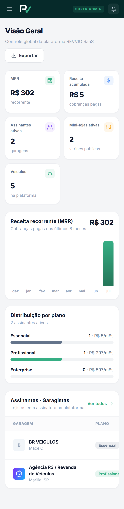

**Sessões:**
1. **Cabeçalho** — "Visão Geral / Controle global da plataforma REVVIO SaaS" +
   **Exportar** (CSV).
2. **5 KPIs empilhados** — **MRR** (recorrente) · **Receita acumulada**
   (cobranças pagas) · **Assinantes ativos** (garagens) · **Mini-lojas ativas**
   (vitrines públicas) · **Veículos** (na plataforma).
3. **Receita recorrente (MRR)** — gráfico de barras dos últimos 8 meses.
4. **Distribuição por plano** — barras por plano com nº de assinantes e o valor
   mensal (Essencial / Profissional / Enterprise).
5. **Assinantes · Garagistas** — prévia da tabela com link **Ver todos**; cada
   linha traz avatar, nome, cidade, plano, MRR, veículos, o **botão de status
   (Ativo / Suspender)** e **Ver loja**.

**Estado — sino de notificações aberto:**

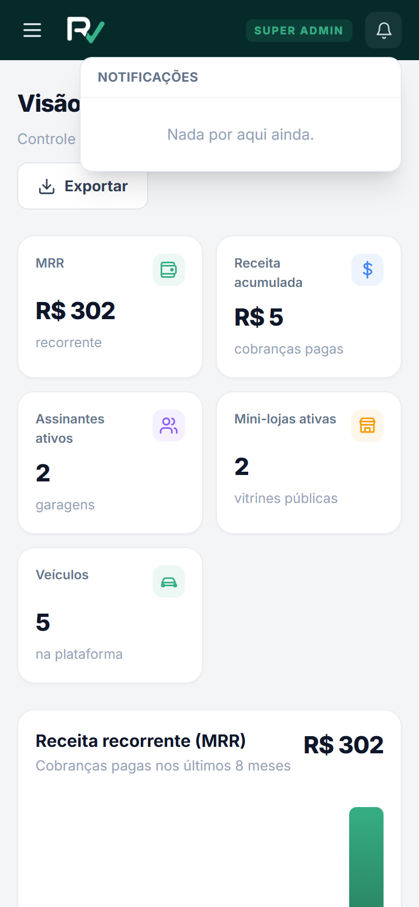

Painel "NOTIFICAÇÕES" ancorado à direita da topbar; vazio mostra *"Nada por aqui
ainda."* Novos veículos e novos vendedores chegam em tempo real via Supabase
Realtime.

### 7.2 `/dashboard/sellers` — Assinantes · Garagistas

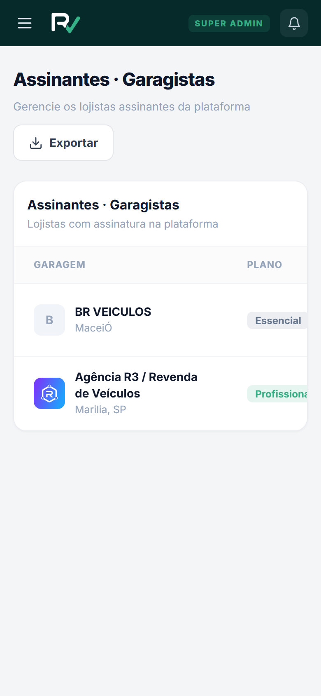

Tabela única com **GARAGEM · PLANO · MRR · VEÍCULOS · STATUS · MINI-LOJA**
(`min-w-[860px]`). **No mobile só as duas primeiras colunas cabem — é preciso
rolar a tabela horizontalmente** para chegar ao status e ao link da loja.
A coluna STATUS é acionável: **Aprovar / Suspender / Reativar** refletem na hora
(`useSetSellerStatus`). O nome leva ao detalhe do assinante.

### 7.3 `/dashboard/sellers/:id` — Detalhe do assinante

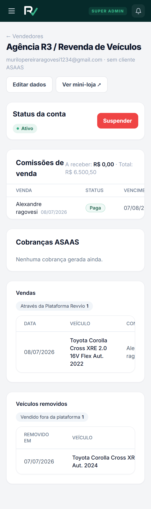

**Sessões:**
1. **Cabeçalho** — link **← Vendedores**, nome da loja, e-mail e o status do
   cliente ASAAS (*"sem cliente ASAAS"* quando ainda não integrado), com os
   botões **Editar dados** e **Ver mini-loja ↗**.
2. **Status da conta** — chip **Ativo** + botão **Suspender**.
3. **Comissões de venda** — resumo *"A receber: R$ … · Total: R$ …"* e tabela
   VENDA · STATUS · VENCIMENTO · VALOR · AÇÃO, com **Reverter** / marcar paga.
4. **Cobranças ASAAS** — `rv_charges` do assinante; vazio: *"Nenhuma cobrança
   gerada ainda."* (é aqui que vive a ação de ativar cobrança/assinatura via
   Edge Function `asaas-billing`).
5. **Vendas** — chips de motivo com contagem + tabela DATA · VEÍCULO ·
   COMPRADOR · PAGAMENTO · MOTIVO · VALOR.
6. **Veículos removidos** — chips de motivo + tabela REMOVIDO EM · VEÍCULO ·
   MOTIVO · VALOR.

**Estado — modal "Editar dados":**

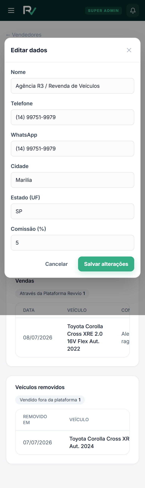

Campos **Nome · Telefone · WhatsApp · Cidade · Estado (UF) · Comissão (%)** e
**Salvar alterações**.

### 7.4 `/dashboard/leads` — Anúncios · Cliques

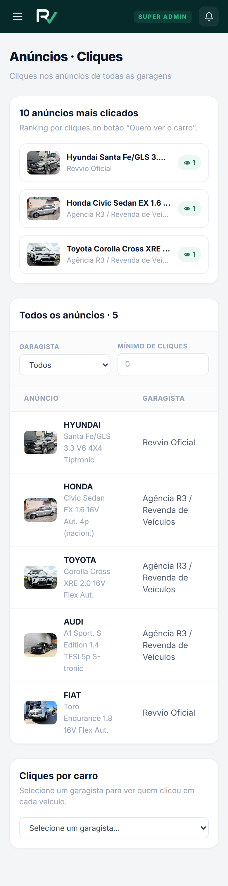

Apesar do caminho `/leads`, o menu chama **Anúncios** e a tela é de **audiência
dos anúncios**:

1. **10 anúncios mais clicados** — *"Ranking por cliques no botão 'Quero ver o
   carro'"*, com veículo, garagista e **👁 N**.
2. **Todos os anúncios · N** — filtros **GARAGISTA** e **MÍNIMO DE CLIQUES** +
   tabela ANÚNCIO · GARAGISTA · STATUS · PREÇO · CLIQUES (`min-w-[720px]`,
   rolagem horizontal no mobile).
3. **Cliques por carro** — *"Selecione um garagista para ver quem clicou em cada
   veículo"* + `select` de garagista; escolhendo, detalha os eventos de
   `rv_click_events`.

### 7.5 `/dashboard/financial` — Gestão Financeira

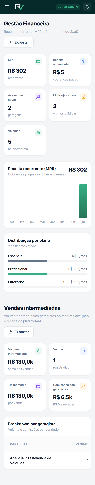

1. **Mesmos 5 KPIs + gráfico de MRR + distribuição por plano** da Visão Geral
   (a receita do SaaS).
2. **Vendas intermediadas** — bloco explicitamente separado, com o aviso
   *"Volume operado pelos garagistas no marketplace (não é receita da
   plataforma)"* e os KPIs **Volume intermediado**, **Vendas**, **Ticket médio**
   e **Comissões dos garagistas** (com o "a receber" na legenda). Valores usam o
   formato curto (`R$ 130,0k`).
3. **Breakdown por garagista** — tabela GARAGISTA · VENDAS · VOLUME · A RECEBER ·
   PAGAS.
4. Botões **Exportar** em ambos os blocos.

### 7.6 `/dashboard/planos` — Controle de Planos

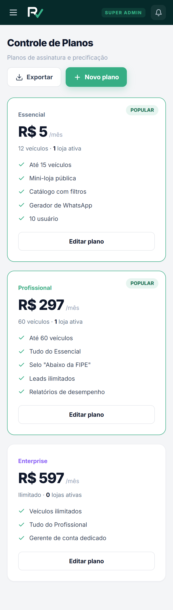

Cards de plano (1 coluna no mobile) com selo **POPULAR**, nome, **preço/mês**,
resumo *"N veículos · N loja(s) ativa(s)"*, lista de destaques e o botão
**Editar plano**. No topo: **Exportar** e **Novo plano**.

**Estado — modal "Editar plano":**

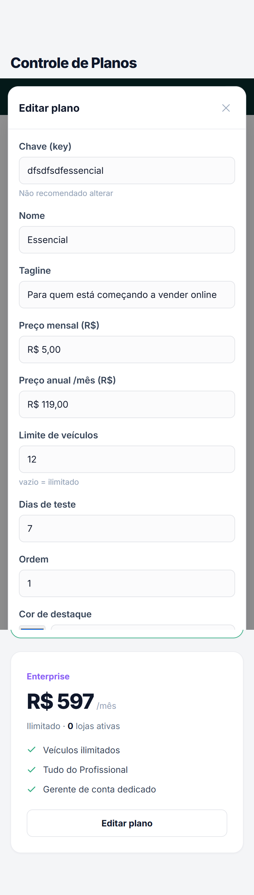

Campos: **Chave (key)** (com o alerta *"Não recomendado alterar"*), **Nome**,
**Tagline**, **Preço mensal (R$)**, **Preço anual /mês (R$)**, **Limite de
veículos** (*"vazio = ilimitado"*), **Dias de teste**, **Ordem**, **Cor de
destaque**, **Texto do botão (CTA)**, **Destaques (um por linha)** e os
interruptores **Marcar como popular** e **Plano ativo**. Rodapé: **Excluir** ·
**Cancelar** · **Salvar alterações** (Excluir abre uma segunda confirmação).

> Estes são os planos públicos de `/vender` (`rv_pricing_plans`) — não confundir
> com o *plano de comercialização por garagista* (`rv_plans`/`rv_plan_items`),
> que é montado no detalhe do assinante e vira assinatura/cobrança no ASAAS.

### 7.7 `/dashboard/veiculos` — Veículos na Plataforma

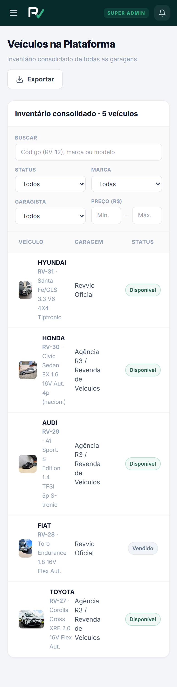

*"Inventário consolidado de todas as garagens"* + **Exportar**.

- **Filtros:** BUSCAR · STATUS · MARCA · **GARAGISTA** · faixa de PREÇO.
- **Tabela** (`min-w-[1020px]`): VEÍCULO (marca + `RV-xx` + modelo) · GARAGEM ·
  STATUS · ANO · PREÇO · FIPE · CLIQUES · AÇÕES.
- **Ações por linha:** **Editar** (mesmo formulário completo do painel, agora em
  escopo global), **Bloquear** (`blocked = true` — some do marketplace e da
  mini-loja **sem apagar nada**) e **Excluir**.

### 7.8 `/dashboard/movimentacoes` — Movimentações

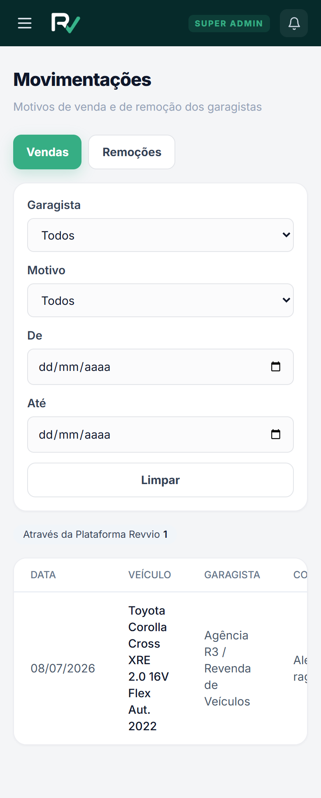

*"Motivos de venda e de remoção dos garagistas"*. Duas abas: **Vendas** e
**Remoções**.

**Aba Vendas:** filtros **Garagista**, **Motivo** (Através da Plataforma Revvio ·
Cliente veio presencialmente na loja · Por indicação · Outro), **De**, **Até** e
**Limpar**; chips com a contagem por motivo; tabela DATA · VEÍCULO · GARAGISTA ·
COMPRADOR · PAGAMENTO · MOTIVO · VALOR.

**Estado — aba Remoções:**

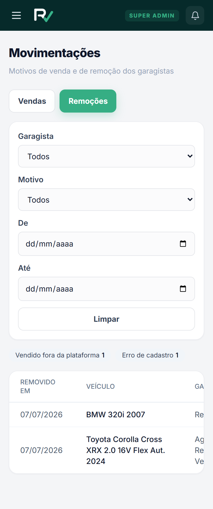

Mesmo layout, com a lista de motivos de remoção (Vendido fora da plataforma ·
Desistência do proprietário · Cadastro duplicado · Erro de cadastro · Veículo
indisponível · Outro) e a tabela REMOVIDO EM · VEÍCULO · GARAGISTA · MOTIVO ·
VALOR. É o relatório de tudo que os garagistas tiram do ar e por quê.

### 7.9 `/dashboard/mini-lojas` — Gestão de Mini-Lojas

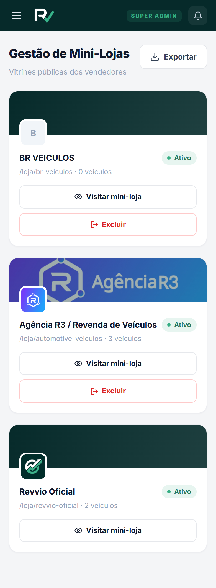

*"Vitrines públicas dos vendedores"* + **Exportar**. Lista em cards (1 por
linha no mobile): avatar, nome, chip **Ativo**, a linha
**`/loja/<slug> · N veículos`** e as ações **Visitar mini-loja** e **Excluir**
(RPC `admin_delete_store`). A própria loja do admin aparece **sem** o botão
Excluir.

### 7.10 `/dashboard/contratos` — Contratos

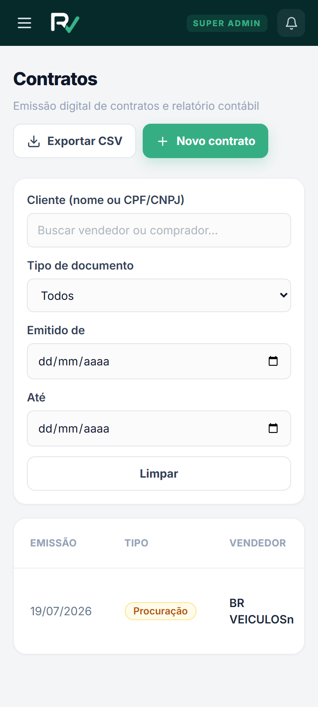

*"Emissão digital de contratos e relatório contábil"* + **Exportar CSV** e
**Novo contrato**.

- **Filtros:** Cliente (nome ou CPF/CNPJ) · **Tipo de documento** (Todos ·
  Intermediação · Compra e Venda · Procuração) · **Emitido de** · **Até** ·
  **Limpar**.
- **Tabela** (`min-w-[980px]`): EMISSÃO · TIPO · VENDEDOR · CPF/CNPJ · VEÍCULO ·
  VALOR DA VENDA · COMISSÃO — funcionando também como **relatório contábil** das
  comissões de intermediação.

### 7.11 `/dashboard/contratos/novo` e `/contratos/:id` — Editor de contrato

| Novo contrato | Editar contrato (Procuração) |
|---|---|
|  | 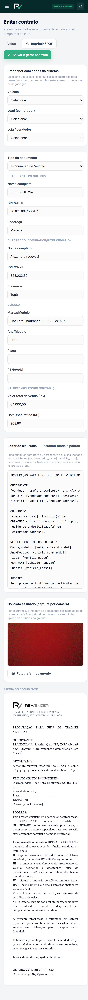 |

*"Preencha os dados — o documento é montado em tempo real ao lado"*. **No
desktop são duas colunas (formulário | prévia); no mobile a prévia vai para
baixo do formulário** — daí a página ser tão longa. Barra de ações no topo:
**Voltar** · **Imprimir / PDF** · **Salvar e gerar contrato**.

**Sessões do formulário:**
1. **Preencher com dados do sistema** — três `select` de auto-preenchimento:
   **Veículo** (todo o inventário, com preço e garagem), **Lead (comprador)** e
   **Loja / vendedor**. *"…depois ajuste apenas o que mudou na negociação."*
2. **Tipo de documento** — Contrato de Intermediação de Venda de Veículo
   Automotor · Contrato de Compra e Venda de Veículo · Procuração de Veículo.
   **Trocar o tipo troca os blocos do formulário e o modelo do texto**: na
   Intermediação aparece *PROPRIETÁRIO / VENDEDOR*; na Procuração,
   *OUTORGANTE* e *OUTORGADO*.
3. **Partes** — Nome completo · CPF/CNPJ · Endereço (por parte).
4. **VEÍCULO** — Marca/Modelo · Ano/Modelo · Placa · RENAVAM (e Chassi no
   modelo).
5. **VALORES (RELATÓRIO CONTÁBIL)** — Valor total da venda (R$) e **Comissão
   retida (R$)**, com a nota *"Calculada automaticamente: 4% da venda"*.
6. **Editor de cláusulas** — texto totalmente editável, com **Restaurar modelo
   padrão**. As **tags entre colchetes** (`[vendedor_name]`, `[vehicle_plate]`,
   `[sale_value]`…) são substituídas pelos campos do formulário na prévia.
7. **Contrato assinado (captura por câmera)** — só na edição. Aviso explícito:
   *"Por segurança, a imagem do documento assinado só pode ser registrada
   fotografando em tempo real — não há upload de arquivos da galeria."* Botão
   **Fotografar novamente** abre o `CameraCapture` (`getUserMedia`), o que no
   celular usa a câmera do aparelho — este é o fluxo **pensado para mobile**.
8. **PRÉVIA DO DOCUMENTO** — folha com timbre *REVVIO LTDA · CNPJ
   63.340.233/0001-53*, o texto completo já com as substituições, local/data e
   as linhas de assinatura. É o que sai no **Imprimir / PDF**.

### 7.12 `/dashboard/aparencia` — Aparência

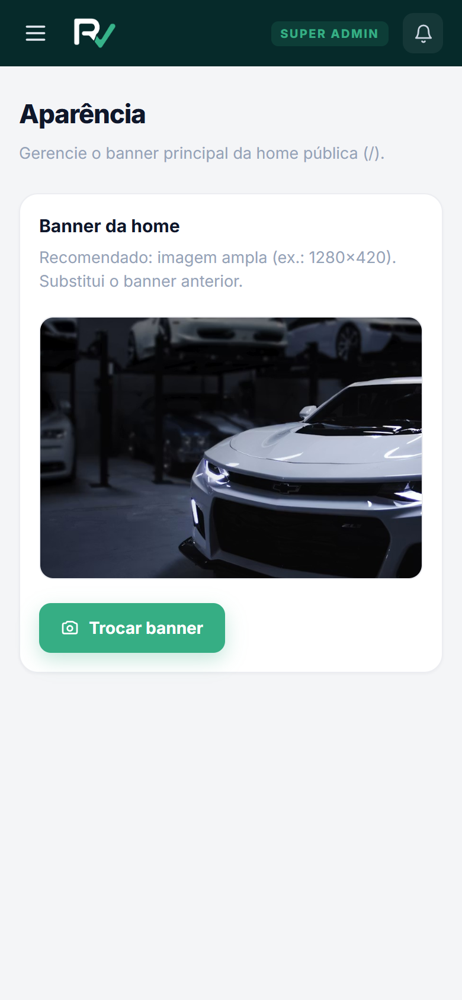

Tela curta: *"Gerencie o banner principal da home pública (/)"*. Card **Banner da
home** com a prévia da imagem atual, a orientação *"Recomendado: imagem ampla
(ex.: 1280×420). Substitui o banner anterior."* e o botão **Trocar banner**.
Grava em `rv_site_settings.home_banner_url` — o efeito aparece imediatamente no
`HomeHero` da seção 4.1.

---

## 8. Módulo Afiliados (desativado por feature flag)

`src/config/features.ts` → `export const AFFILIATES_ENABLED = false;`

Com a flag em `false`, **em toda a aplicação** somem: as rotas `/afiliado`,
`/afiliado/desempenho`, `/afiliado/perfil`, `/painel/afiliados` e
`/dashboard/afiliados`; os itens de menu; o seletor de afiliado no registro de
venda; a atribuição por link (`?ref=`); e o toggle de afiliados no plano.
**Nenhum arquivo foi removido** — os componentes (`affiliate/pages/Carros.tsx`,
`Desempenho.tsx`, `Perfil.tsx`, `seller/pages/Afiliados.tsx`,
`admin/pages/Afiliados.tsx`) continuam no repositório e voltam a funcionar
apenas trocando a flag para `true`.

Por isso **não há print destas telas**: hoje elas não são alcançáveis pela
aplicação (a rota nem é montada, e o acesso direto cai no 404).

---

## 9. Comportamento de sessão (transversal)

### 9.1 Boot e persistência
O cliente Supabase usa `persistSession: true`, `autoRefreshToken: true` e
`detectSessionInUrl: true` — a sessão sobrevive a fechar e reabrir o navegador,
e tokens em hash de link de e-mail são consumidos automaticamente.

No boot, o `AuthProvider` faz `getSession()`, carrega o perfil e só então desliga
`loading`. Os `onAuthStateChange` posteriores assumem o controle.

### 9.2 A proteção contra "o modal fechou sozinho"
Ao voltar de outra aba (ou ao renovar o token), o Supabase reemite
`SIGNED_IN`/`TOKEN_REFRESHED` **para a mesma sessão**. Se o provider recarregasse
o perfil e religasse `loading`, os guards desmontariam a árvore de rotas — era
isso que **fechava o modal de cadastro de veículo e apagava tudo que já tinha
sido digitado**. Hoje, se `user.id` é o mesmo já carregado, **nada acontece**.
No celular, onde trocar de app é constante, esse detalhe é o que segura o
formulário longo — junto com o rascunho em `localStorage` (§3.7).

### 9.3 Logout resiliente
`signOut({ scope: 'local' })`: não depende do endpoint remoto de revogação, que
falhava de forma intermitente e deixava o usuário logado ("hora sai, hora não").
Se ainda assim a chamada falhar, o provider **limpa manualmente as chaves
`sb-*-auth-token` do `localStorage`** e zera o estado. Depois, `PanelShell` /
`PublicHeader` navegam para `/login`.

### 9.4 Redirecionamento por papel (`/app`)
```
loading            → "Carregando…"
sem user           → /login
isAdmin            → /dashboard
sem perfil seller  → /cadastro-vendedor  (ou /  se for comprador)
status = pending   → /aguardando-aprovacao
status = suspended → /conta-suspensa
afiliado (flag on) → /afiliado
demais             → /painel
```

### 9.5 Guards
- `ProtectedRoute` — exige sessão; sem ela vai para `/login` guardando
  `state.from`.
- `RoleRoute` — **admin passa por qualquer área**; senão valida perfil, status
  (`pending`/`suspended`) e papel; papel errado → `/`.
- `ManagerOnly` — dentro do `/painel`, restringe rotas de gestão ao
  garagista/admin.
- A segurança real é o **RLS**; os guards são apenas navegação.

### 9.6 Gate de contato do comprador
Ver o anúncio é livre; **falar com a loja exige conta**. Tanto o botão "Quero ver
o carro" (§4.4) quanto os canais da mini-loja (§4.5) abrem o `BuyerAuthModal`
quando não há sessão e **retomam a ação sozinhos** depois do login/cadastro.

---

## 10. Observações e achados de UX mobile

Levantados a partir das capturas em 390 × 844 e do código:

1. **Home — título coberto pelo card de busca.** O card "Busca Rápida" usa
   `absolute bottom-0 … translate-y-1/2` sobre um banner de 460px; no mobile ele
   se sobrepõe ao cabeçalho *"EXPLORE POR MARCA / Marcas Mais Buscadas / Toque em
   uma marca…"*, do qual só se lê o final ("disponíveis").
   → `HomeHero.tsx` / `HomeMarcas.tsx`.
2. **Sem navegação principal no header público.** `PublicHeader` esconde os links
   *Comprar/Vender* abaixo de `sm` e não oferece hambúrguer; no celular a
   navegação depende do rodapé e dos CTAs internos.
3. **Placeholder truncado na busca do `/comprar`.** O campo do hero corta o
   texto ("Busque por marca ou model") na largura de 390px.
4. **Tabelas do admin exigem rolagem lateral.** Padrão consciente
   (`overflow-x-auto` + `min-w-[720…1080px]`), mas em telas como *Assinantes* e
   *Veículos* as colunas de ação (STATUS, MINI-LOJA, AÇÕES) ficam completamente
   fora da primeira vista.
5. **Filtros do marketplace ocupam a primeira tela inteira.** Como o `aside` vem
   antes na ordem do DOM, no mobile o usuário rola ~1 tela e meia de filtros
   antes do primeiro carro. Um "Filtros" recolhido por padrão no mobile resolveria.
6. **Funil de leads corta as colunas.** No Kanban só a coluna *Novo* cabe na
   tela; as outras quatro dependem de arrasto horizontal — que concorre com o
   drag-and-drop dos cards.
7. **Formulário de veículo é muito longo no celular.** ~15 blocos numa única
   modal rolável. Mitigado pelo rascunho automático (§3.7) e pelo
   `closeOnBackdrop={false}`, mas é candidato natural a wizard por etapas.
8. **Editor de contrato: prévia empilhada.** No mobile a prévia do documento vem
   depois de todo o formulário, tornando a página muito longa; a captura por
   câmera, porém, é um fluxo **desenhado para o celular** e funciona bem ali.
9. **Categoria da "Busca Rápida" não é usada.** O `select`
   Carros/Motos/Caminhões da home é estado local e **não** entra na querystring
   enviada ao `/comprar`.

---

### Anexo — índice das imagens

Todos os arquivos estão em `docs/mobile/img/`.

| Arquivo | Tela |
|---|---|
| `01-home.png` | `/` Home |
| `02-comprar.png` · `02b-comprar-busca.png` | `/comprar` catálogo · com busca |
| `03-vender.png` | `/vender` landing + planos |
| `04-veiculo-detalhe.png` · `04b-veiculo-lightbox.png` · `04c-veiculo-modal-comprador.png` | `/veiculo/:id` · lightbox · gate de login |
| `05-loja-storefront.png` | `/loja/:slug` mini-loja |
| `06-login.png` | `/login` |
| `07-cadastro-comprador.png` | `/cadastro` |
| `08-minha-conta.png` | `/minha-conta` (redirect p/ login) |
| `09-cadastro-vendedor.png` | `/cadastro-vendedor?plan=…` |
| `10-definir-senha.png` | `/definir-senha` (link inválido) |
| `11-pagamento-confirmado.png` | `/pagamento-confirmado` |
| `12-aguardando-aprovacao.png` · `13-conta-suspensa.png` | telas de status |
| `14-politica-privacidade.png` · `15-termos-condicoes.png` | páginas legais |
| `16-404.png` | rota inexistente |
| `20-admin-dashboard.png` · `20b-admin-drawer.png` · `20c-admin-notificacoes.png` | `/dashboard` · drawer · sino |
| `21-admin-assinantes.png` | `/dashboard/sellers` |
| `22-admin-assinante-detalhe.png` · `22b-admin-assinante-editar.png` | `/dashboard/sellers/:id` · modal |
| `23-admin-anuncios-leads.png` | `/dashboard/leads` |
| `24-admin-financeiro.png` | `/dashboard/financial` |
| `25-admin-planos.png` · `25b-admin-plano-editar.png` | `/dashboard/planos` · modal |
| `26-admin-veiculos.png` | `/dashboard/veiculos` |
| `27-admin-movimentacoes.png` · `27b-admin-movimentacoes-remocoes.png` | `/dashboard/movimentacoes` (2 abas) |
| `28-admin-mini-lojas.png` | `/dashboard/mini-lojas` |
| `29-admin-contratos.png` | `/dashboard/contratos` |
| `30-admin-contrato-novo.png` · `31-admin-contrato-editar.png` | editor de contrato |
| `32-admin-aparencia.png` | `/dashboard/aparencia` |
| `40-painel-dashboard.png` · `40b-painel-drawer.png` | `/painel` · drawer |
| `41-painel-leads.png` · `41b-painel-leads-funil.png` | `/painel/leads` (cards e funil) |
| `42-painel-veiculos.png` · `42b-painel-veiculo-novo.png` · `42c-painel-veiculos-lista.png` | `/painel/veiculos` · modal · lista |
| `43-painel-vendedores.png` · `43b-painel-convidar-vendedor.png` | `/painel/vendedores` · modal |
| `44-painel-vendas.png` · `44b-painel-registrar-venda.png` | `/painel/vendas` · modal |
| `45-painel-financeiro.png` | `/painel/financeiro` |
| `46-painel-gerador-whatsapp.png` | `/painel/gerador-whatsapp` |
| `47-painel-perfil.png` | `/painel/perfil` |
